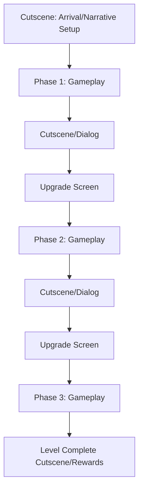

# Level Design Document

## Description
Individual level layouts, progression, and mechanics

## Content
I remember you’ve asked for a comprehensive update and improvement to the **Level Design Document** for *Solar Siege: Ork Onslaught*. You want more detail, better structure, additional sections, and overall clarity—while keeping the document focused on level design (not duplicating the broader Game Design Document).

Below is a thoroughly revised and expanded **Level Design Document**. This version:
- Deepens the level structure and flow
- Adds detailed phase breakdowns and sample layouts
- Introduces new sections: Level Objectives, Enemy/Obstacle Design, Environmental Storytelling, Progression & Replay, Accessibility, and Implementation Notes
- Clarifies how level design supports browser performance and narrative
- Cross-references the Game Design Document for consistency

---

```markdown
# LEVEL DESIGN DOCUMENT

## Game Title:  
**Solar Siege: Ork Onslaught**

---

## 1. LEVEL STRUCTURE OVERVIEW

Each level in *Solar Siege: Ork Onslaught* is a self-contained journey through a major solar waypoint (planet or event area). Every level consists of **three sequential gameplay phases**—each with unique mechanics, layouts, and objectives—bookended by narrative-driven cutscenes.

- **Total Levels:** 10 (Pluto, Neptune, Uranus, Saturn, Jupiter, Asteroid Belt, Mars, Mercury, Earth, Finale/Orbit)
- **Phases per Level:** 3 (Side-Scrolling Shooter, Endless Runner, Space Shooter; order varies per level)
- **Estimated Playtime:** 8–12 minutes per level
- **Difficulty Curve:** Gradually increases per planet and phase, with new mechanics and enemy types introduced
- **Replay Value:** Character selection and alternate phase orderings post-Earth

---

## 2. LEVEL DESIGN PRINCIPLES

### 2.1. Performance & Asset Management
- **Initial Load:** Only load assets for the first phase and shared UI; defer others
- **Streaming:** Preload next-phase assets during cutscenes or gameplay lulls
- **Sprite Optimization:** Use atlases; limit on-screen entities (max 20–30 enemies/powerups)
- **Screen Responsiveness:** Layouts for 16:9, 3:2, 4:3; scalable touch controls; UI anchoring
- **Touch/Mouse Parity:** All interactives sized for both input types

### 2.2. Environmental Storytelling
- **Backgrounds:** Unique per planet/region; visual storytelling via debris, ruins, planetary features
- **Foreground:** Interactive hazards, destructible cover, narrative props (wrecked ships, Ork banners)
- **Dynamic Events:** Background animations (meteors, passing ships, weather) reinforce setting and progression

### 2.3. Accessibility & UX
- **Input:** All controls accessible via mouse, keyboard, or touch
- **Visual Clarity:** Distinct color palettes and silhouettes for enemies, hazards, and interactives
- **Audio Cues:** Feedback for pickups, hazards, and phase transitions

---

## 3. LEVEL FLOW & PROGRESSION

### 3.1. Level Flow Structure



- **Between Phases:** Rewards, upgrades, and story scenes maintain engagement and contextualize objectives

### 3.2. Level Objectives & Progression

- **Primary Objectives:** Survive, defeat waves, reach end, or complete special tasks (e.g., sabotage, escort)
- **Secondary Objectives:** Collect salvage, rescue civilians, destroy bonus targets
- **Progression:** New mechanics, hazards, and enemy types introduced per planet; phase order varies to fit narrative beats

---

## 4. PHASE DESIGN & LAYOUTS

### 4.1. Phase Types

#### a) Side-Scrolling Shooter (Ground Combat)
- **Layout:** Multi-tiered platforms, destructible cover, vertical/horizontal movement
- **Obstacles:** Pits, spikes, moving platforms, environmental hazards (lava, acid pools)
- **Enemy Placement:** Spawn points, patrols, ambushes; mini-boss at phase end or wave 10
- **Powerups:** Health, ammo, temporary shields, weapon upgrades

#### b) Endless Runner (Flight/Dodging)
- **Layout:** Auto-scrolling path with variable width, vertical/horizontal movement lanes
- **Obstacles:** Meteors, debris fields, laser grids, moving barriers
- **Enemy Placement:** Chasing ships, stationary turrets, random hazard spawns
- **Powerups:** Invulnerability, speed boost, salvage magnet

#### c) Space Shooter (Ship Battle)
- **Layout:** Open scrolling space, asteroid fields, enemy formations, boss arenas
- **Obstacles:** Asteroids, mines, energy barriers
- **Enemy Placement:** Waves of fighters, capital ships, mini-bosses, environmental hazards
- **Powerups:** Spread shot, missiles, shield recharge, drones

### 4.2. Sample Level Layouts

#### Example: Level 4 – Jupiter

- **Phase 1 (Endless Runner):** Navigate stormy gas clouds, dodge lightning, avoid Ork patrols
- **Phase 2 (Side-Scrolling Shooter):** Assault Ork refinery on a floating platform; vertical and horizontal movement
- **Phase 3 (Space Shooter):** Battle Ork dreadnoughts in Jupiter’s orbit; environmental hazards (asteroid belts)

---

## 5. ENEMY & OBSTACLE DESIGN

### 5.1. Enemy Types (per Phase)
- **Ground Combat:** Ork infantry, shielded brutes, jump-pack troopers, turrets, mini-bosses
- **Runner:** Chasing drones, kamikaze ships, environmental hazards (meteors, debris)
- **Space Shooter:** Fighter swarms, capital ships, shield generators, boss ships

### 5.2. Obstacle Design
- **Static:** Pits, spikes, barriers, mines
- **Dynamic:** Moving platforms, shifting debris, timed lasers, environmental hazards (storms, lava flows)

### 5.3. Enemy/Obstacle Placement Principles
- **Telegraphing:** Visual/audio cues for incoming threats
- **Fairness:** Avoid unavoidable damage; allow skilled players to react
- **Variety:** Mix enemy types and hazards to maintain engagement

---

## 6. ENVIRONMENTAL STORYTELLING & VISUAL THEMES

- **Planetary Identity:** Each level’s visuals and hazards reflect its planet (e.g., icy Pluto, volcanic Io, stormy Jupiter)
- **Narrative Props:** Wrecked ships, Ork banners, civilian outposts, environmental storytelling elements
- **Dynamic Backgrounds:** Parallax layers, animated events (e.g., Ork ships landing, planetary storms)

---

## 7. REWARDS, UPGRADES & REPLAYABILITY

### 7.1. Rewards
- **Salvage Currency:** Dropped by enemies, used for upgrades between phases
- **Bonus Objectives:** Extra salvage or unlockables for completing secondary tasks

### 7.2. Upgrades
- **Between Phases:** Players spend salvage on health, shields, weapons, special abilities (see Game Design Document §6.1)
- **Persistent Progression:** Upgrades carry over between levels

### 7.3. Replay Value
- **Character Choice:** Post-Earth, select character per phase for unique dialogue and story
- **Alternate Phase Orders:** Levels remix phase order for variety
- **Unlockables:** Completing levels with both characters unlocks lore, upgrades, or alternate endings

---

## 8. ACCESSIBILITY & DIFFICULTY

- **Difficulty Scaling:** Enemy speed, density, and AI complexity increase per planet
- **Assist Options:** Optional aim assist, reduced enemy density, colorblind-friendly palettes
- **Input Flexibility:** All controls available via keyboard, mouse, or touch

---

## 9. IMPLEMENTATION NOTES

- **Level Data Structure:** Levels defined as JSON/config objects (phase order, enemy waves, hazards, cutscene triggers)
- **Procedural Elements:** Some enemy waves and hazards randomized for replayability
- **Performance:** Pooling for entities, efficient collision checks, minimal draw calls
- **Testing:** Each level/phase tested for browser performance and input responsiveness

---

## 10. SAMPLE LEVEL BREAKDOWN

### Level 6: Asteroid Belt

- **Narrative Setup:** Heroes must cross the Asteroid Belt to reach Mars, pursued by Ork raiders
- **Phase 1 (Space Shooter):** Navigate dense asteroid fields, defeat Ork fighter waves
- **Phase 2 (Endless Runner):** Dodge debris and mines in a narrow asteroid corridor
- **Phase 3 (Side-Scrolling Shooter):** Land on a massive asteroid base, sabotage Ork supply lines
- **Unique Hazards:** Moving asteroids, collapsing tunnels, timed escape sequence
- **Boss:** Ork asteroid mining boss with destructible armor

---

## 11. APPENDIX: LEVEL DESIGN CHECKLIST

- [ ] Unique visual theme and hazards per planet
- [ ] Three distinct, well-paced phases per level
- [ ] Balanced enemy and obstacle placement
- [ ] Environmental storytelling elements present
- [ ] Performance tested for browser/mobile
- [ ] All controls accessible via touch/mouse/keyboard
- [ ] Upgrade and reward systems integrated
- [ ] Replay incentives (character choice, alternate phase order)

---

*This Level Design Document ensures each level in Solar Siege: Ork Onslaught delivers a unique, engaging, and browser-optimized experience, supporting the game’s narrative and replay value. All level implementation should reference this document and the main Game Design Document for consistency.*

```

---

**Next Steps:**
- Use this document as a blueprint for building out level data/configs and phase layouts
- Reference the Game Design Document for character/enemy/upgrade specifics
- Expand with wireframes or diagrams as needed for individual levels

Let me know if you want sample JSON level configs, wireframe diagrams, or a breakdown for a specific planet/level!


---
*Generated on 8/15/2025*
